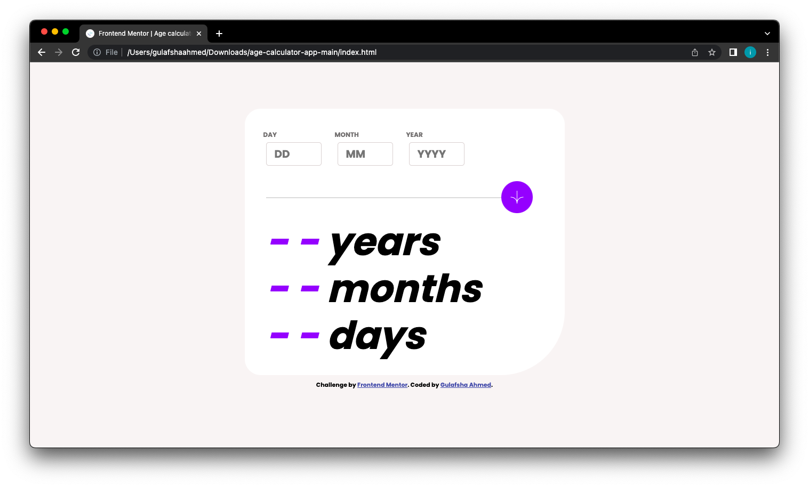
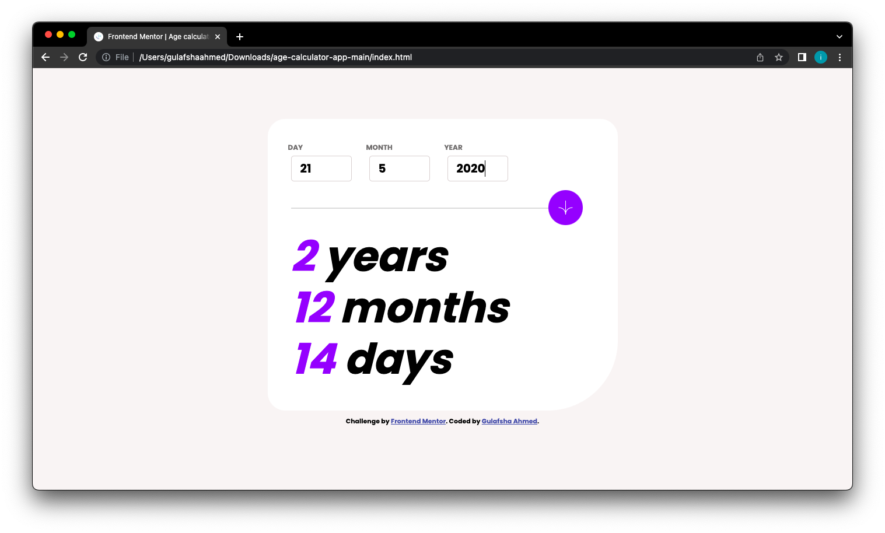
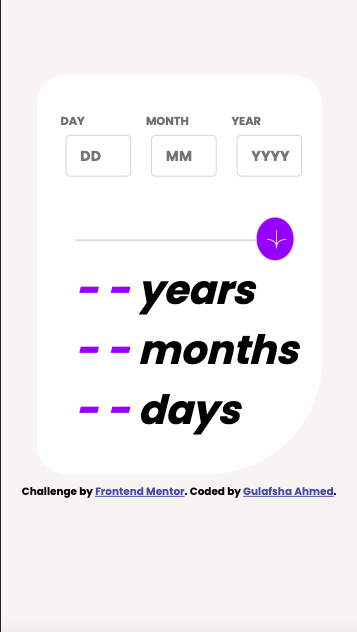

# Frontend Mentor - Age calculator app solution

This is a solution to the [Age calculator app challenge on Frontend Mentor](https://www.frontendmentor.io/challenges/age-calculator-app-dF9DFFpj-Q). Frontend Mentor challenges help you improve your coding skills by building realistic projects. 

## Table of contents

- [Overview](#overview)
  - [The challenge](#the-challenge)
  - [Screenshot](#screenshot)
  - [Links](#links)
- [My process](#my-process)
  - [Built with](#built-with)
  - [Useful resources](#useful-resources)
- [Author](#author)

## Overview

### The challenge

Users should be able to:

- View an age in years, months, and days after entering a valid date in the input fields
- Receive validation errors if:
  - Any field is empty when the inputs are entered
  - The day number is not between 1-31
  - The month number is not between 1-12
  - The year is in the future
  - The date is invalid e.g. 31/04/1991 (there are 30 days in April)
- View the optimal layout for the interface depending on their device's screen size
- See hover and focus states for all interactive elements on the page
- **Bonus**: See the age numbers animate to their final number when the form is submitted

### Screenshot

### Links

- Solution URL: [Github solution URL](https://github.com/pyjamaSamm/Age_Calculator-FrontendMentor_II.git)
- Live Site URL: [Live site URL](https://pyjamasamm.github.io/Age_Calculator-FrontendMentor_II/)

## My process

### Built with

- Semantic HTML5 markup
- CSS custom properties
- Flexbox
- CSS Grid
- JQuery
- JavaScript

### Useful resources

- [W3Schools](https://www.w3schools.com/)
- [MDN Web Docs](https://developer.mozilla.org/en-US/)

## Author

- Website - [Gulafsha Ahmed](https://www.your-site.com)
- Frontend Mentor - [@pyjamaSamm](https://www.frontendmentor.io/profile/pyjamaSamm)
